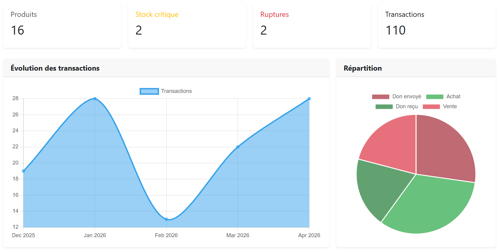
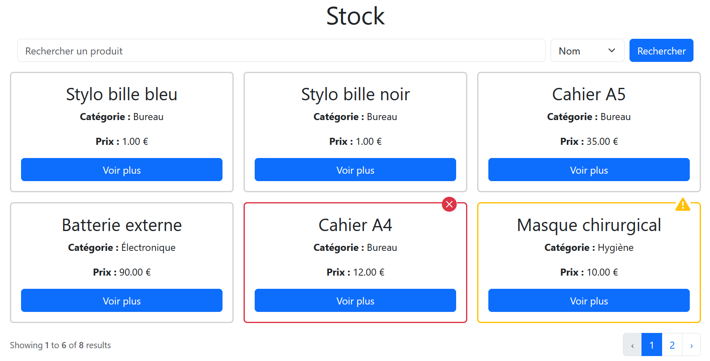
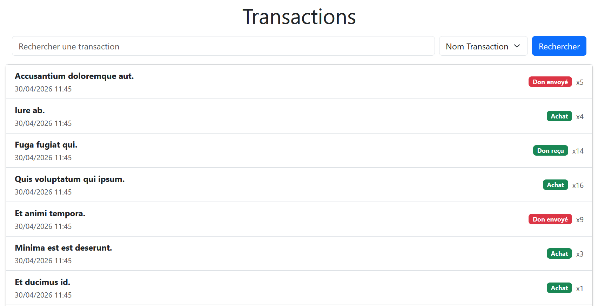

# Ministockweb

**Ministockweb** est une application de gestion de stock simple développée en **Laravel**, avec une interface utilisateur réalisée avec **Bootstrap**.
Ce projet est une adaptation web du projet [ministock](https://github.com/donneger-k/ministock) original.

---

# Objectif

Projet réalisé dans le cadre de mon apprentissage de Laravel afin de comprendre le fonctionnement des frameworks PHP et les bases du développement web backend.

---

## Aperçu de l'application

### Dashboard



### Stock



### Transactions



---

# Fonctionnalités

- Créer des produits avec informations personnalisées
- Modifier des produits existants
- Ajouter et supprimer des produits dans un stock
- Suivre des mouvements (entrées et sorties)
- Consulter l'historique complet des opérations
- Rechercher des produits à l’aide de filtres

---

## Technologies utilisées

- **Laravel**
- **Bootstrap 5** (style graphique)
- **Git** & **GitHub** pour le versionnement

---

## Prérequis techniques

Avant de lancer le projet, assurez-vous d'avoir installé :

- PHP avec une version supérieure ou égale à 8.1
- Composer
- Une base de données
- Node.js et npm (optionnel, uniquement si vous souhaitez compiler les assets front-end)

---

## Accès rapide

Une fois le serveur lancé, rendez-vous sur :

http://127.0.0.1:8000

---

## Exécuter le projet

### 1. Cloner le dépôt

```bash
git clone https://github.com/donneger-k/ministockweb.git
cd ministockweb
```

### 2. Installer les dépendances

```bash
composer install
```

### 3. Configurer l’environnement

```bash
cp .env.example .env
```

Puis configurer la base de données (MySQL, SQLite)

### 4. Générer la clé de l’application

```bash
php artisan key:generate
```

### 5. Lancer les migrations

```bash
php artisan migrate
```

### 6. (Optionnel) Remplir la base avec des données de test

Des données d'exemple (produits, transactions...) seront générées afin de tester rapidement l'application.

 ```bash
php artisan db:seed
```

### 7. Démarrer le serveur

```bash
php artisan serve
```

Puis accéder à l'application via :

```bash
http://127.0.0.1:8000
```

# Statut du projet

- En cours de réalisation

Ce projet est fonctionnel et utilisable.

# Auteur

Projet réalisé par **DONNEGER Kilyan** dans le cadre de mon portfolio.

## Licence

Ce projet est sous licence MIT.
Vous pouvez l’utiliser librement à des fins personnelles ou éducatives, à condition de créditer l’auteur.

Voir le fichier [`LICENSE`](./LICENSE) pour plus d’informations.

## Crédits

Les crédits des ressources utilisées (images, icônes, etc.) sont disponibles dans la page dédiée de l’application.